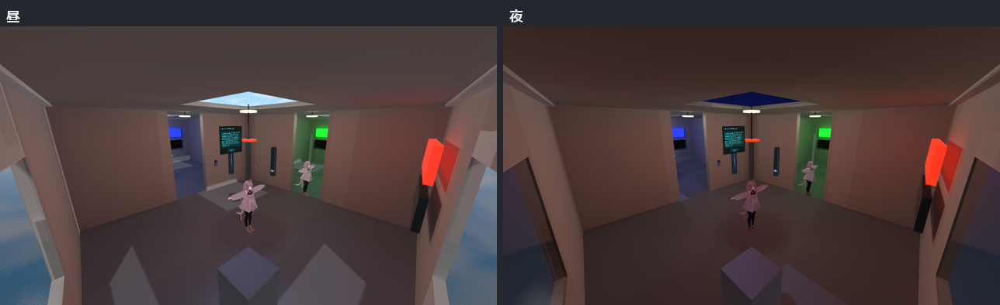
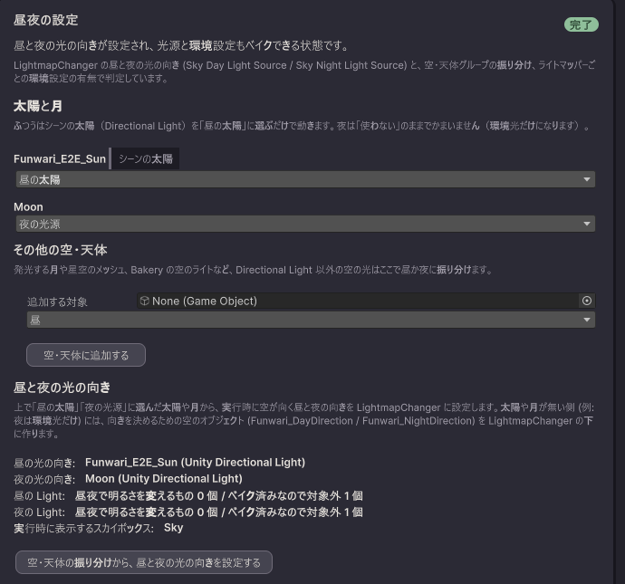

# 昼と夜を切り替える

空と天体の光を昼と夜で別々にベイクし、実行時に切り替えます。点灯・消灯とは独立した軸です。Bakery と Unity Builtin で使えます。

<video src="/funwari-lightblend-docs/video/daynight.mp4" controls></video>

動画: 部屋 C の天窓から見た昼 → 夕方 → 夜。空の光だけが変わり、部屋の照明はそのままです。

## 手順

1. 工程1「準備」の「使う機能を選ぶ」で「昼と夜を切り替える」をオンにします。工程3 のあとに「昼夜」の工程が現れます。太陽・月・空の環境光は工程3 ではなく、この工程で振り分けます。
2. 「昼夜」の工程で、シーンの Directional Light を「昼の太陽」に選びます。夜は「使わない」のままでも構いません（環境光だけになります）。月や星空の発光メッシュがあれば「夜」に振り分けます。
3. 「空・天体の振り分けから、昼と夜の光の向きを設定する」を押します。実行時に空が向く昼と夜の向きが設定されます。
4. Unity Builtin のときは、同じ工程の「昼夜の環境設定」で、昼と夜それぞれの「いまの Lighting から取り込む」を押します。Unity の Lighting ウィンドウを昼の状態にして昼を取り込み、夜の状態にして夜を取り込みます。環境光のモードが Custom だと取り込めないので、Skybox / Trilight / Flat のいずれかにしてから押します。

5. 工程4「ペア生成」と工程5「ベイク」を進めます。「昼夜」の工程が整っていないとベイクは始まらず、足りないものが理由付きで表示されます。

昼夜を使うベイクでは、**ベイクに参加するライトをすべて工程3 で振り分けておきます**（点灯・消灯時のみ・常時のどれか）。振り分けていないライトが 1 つでもあると「ツールの管理下にありません」の理由でベイクが始まりません（発光の未指定は常時として扱われます）。Bakery 用の空のライト（BakerySkyLight など）は Unity Builtin では使えないので、Directional Light の太陽と月に置き換えてください。

できた状態: 「プレビュー」で昼夜のスライダーを動かして確かめられます。

## 動く影が欲しいとき

「昼夜」の工程の「リアルタイムの太陽を置く」をオンにします。消灯を制御するオブジェクトの隣に、太陽を動かす仕組みが作られ、昼夜の値に合わせて向き・色・強さが変わります。リアルタイムライトなので負荷は増えます。

## 知っておくこと

- 以前の版で昼夜を設定したシーンを開くと、「昼の光の向きが未設定です」でベイクが始まらないことがあります。「昼夜」の工程で「空・天体の振り分けから、昼と夜の光の向きを設定する」をもう一度押してください。

- 設定したあとに空・天体の光源や環境設定を変えると、ベイクが「要再実行」になります。「昼夜」の工程を完了し直しても、ベイクし直すまでは戻りません。
- 実行時に表示する空は、消灯を制御するオブジェクトの Skybox Material と昼夜の値で切り替わります。光の向きを設定したときに Skybox Material が空なら、シーンのスカイボックスが入ります。
