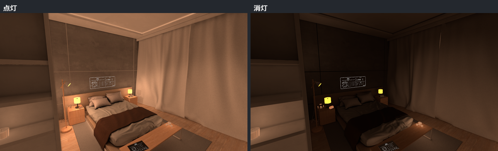

# ふんわり消灯ギミックとは

VRChat ワールドの照明を、点灯から消灯までなめらかに切り替えるツールです。
点灯用と消灯用のライトマップを用意し、Light Volumes、Reflection Probes、ライト、発光も一緒に切り替えます。

ひとつのメインウィンドウに6ステップのガイドをまとめています。左のステップを上から進めればセットアップが完了します。

## なぜ「ベイクした光の切り替え」なのか

消灯ギミックを、リアルタイムライトのオン・オフで作ることもできます。
ただしその方法には、VRChat ワールドでは大きな代償があります。

- **負荷**: リアルタイムライトはライトの数だけ描画コストが積み上がります
- **見た目**: リアルタイムライトは直接光しか出せません。壁や床を回り込むバウンス光、面で光る照明、柔らかい影は作れません

ふんわり消灯ギミックは、**点灯と消灯のそれぞれを普通にベイクして、2枚のライトマップを
クロスフェード**します。だから消灯しても間接光の余韻が残り、描画負荷はライト0本のまま、
テクスチャを1枚多く合成するぶんしか増えません。アバターなど動くものは Light Volumes が、
鏡や金属の映り込みは Reflection Probe が、同じつまみで一緒に切り替わります。

---

## このツールでできること

- ワールド全体の点灯と消灯をなめらかに切り替える
- 明るい場所ほど最後まで灯って見える消え方を作る
- アバターなど動くオブジェクトの明るさを Light Volumes で連動させる
- 鏡や金属の映り込みを Reflection Probes で切り替える
- ライトと発光を「点灯」「常時」「消灯時のみ」に分ける
- 各工程の完了状態と再実行が必要な工程をダッシュボードで確認する

---

## 導入の前に

**unitypackage をインポートする前に、下の必須パッケージを先に導入してください。**
そろっていないプロジェクトへインポートすると、その場でコンパイルエラーになり、
他のツールも巻き込んで動かなくなります（ファイルを削除すれば元に戻ります）。

## 必須

| パッケージ | 入手先 | 備考 |
|---|---|---|
| VRChat SDK 3.x (Worlds) | VCC | |
| UdonSharp | VCC (Worlds プロジェクトに同梱) | |
| **VRC Light Volumes 2.1.3** | VCC (red.sim.lightvolumes) | **未導入だとインポート直後にコンパイルエラーになります** |

- VRC Light Volumes は **2.1.3 で動作を確認しています。3.x は未対応・未検証です。**
- Unity は 2022.3 LTS を想定しています。

## 対応シェーダー（使うものだけ導入）

lilPBR / Filamented / Unity Standard / Mochie Standard / Mochie Standard Lite /
Poiyomi Toon (World)。ベースシェーダー本体は同梱していません。
対応表と配置場所は配布ページをご覧ください。

## 導入の手順

1. 上の必須パッケージを導入する
2. この unitypackage をインポートする
3. `Tools > ふんわり消灯ギミック > メインウィンドウ` を開き、「ガイド」に沿って進める

使い方の詳細（画像つきの手引き）は配布ページに掲載しています。

## 困ったとき

- 利用条件は同梱の `LICENSE.md` にまとめています
- 判断に迷うことがあれば、BOOTH のメッセージから気軽にお問い合わせください
