# クイックスタート

セットアップの流れを、必要なものの確認から仕上げまで順に説明します。
ツールの概要は[はじめに](intro.md)をご覧ください。

## 必要なもの

| 必要なもの | 補足 |
|-----------|------|
| Unity 2022.3 LTS | VRChat ワールド用の標準バージョン |
| VRChat SDK 3.x (Worlds) + UdonSharp | VCC から導入 |
| 対応シェーダー | 下の対応表を参照 |
| VRC Light Volumes | 動的オブジェクトの明るさ切り替えに使用 |
| LuraSwitch2 | スイッチやスライダーを置く場合に使用 |
| Bakery（任意） | Unity Builtin でもベイク可能 |

> Bakery を使う場合は「Dominant Direction」を選んでください。RNM、SH、MonoSH には対応していません。
> ノーマルマップを使わない軽量なワールドでは「Half (Non-Directional)」も使えます。

詳しい依存関係は [依存関係](dependencies) をご覧ください。

---

## 対応シェーダー

| ベースシェーダー | 備考 |
|-----------------|------|
| **lilPBR** | |
| **Filamented** | |
| **Unity Standard** | Unity 標準シェーダー |
| **Mochie Standard** | |
| **Mochie Standard Lite** | |
| **Poiyomi Toon World** | World 用のみ対応 |

ステップ2の「対象のマテリアルをまとめて変換する」は、シーン内の対応マテリアルをまとめて LightmapBlend 版へ変換します。元のマテリアルは残ります。

---

## セットアップを始める前に（とても大事です）

このツールは、完成済みの点灯ルックを基準に消灯ルックを追加します。先に点灯時の見た目を仕上げてください。

1. Unity プロジェクト全体をバックアップします。
2. 通常の手順で点灯状態をベイクし、解像度や Sample 数を確定します。
3. Reflection Probe の数、位置、Box Size を確定します。
4. VRC Light Volumes の数、位置、大きさを確定します。
5. ライトと発光を「点灯」「常時」「消灯時のみ」のどれにするか決めます。

| グループ | 役割 | 例 |
|---------|------|-----|
| **点灯** | 点灯時に光り、消灯時に暗くなる | 天井照明、デスクライト |
| **常時** | 状態に関係なく光る | 装飾 LED、アニメーションする看板 |
| **消灯時のみ** | 消灯時に光る | 非常灯、星空 |

---

## セットアップの手順

Unity のメニューから `Tools > ふんわり消灯ギミック > メインウィンドウ` を開きます。
上部の「ガイド」を選び、左側の6ステップを順番に進めてください。「ダッシュボード」では全工程の状態をまとめて確認できます。

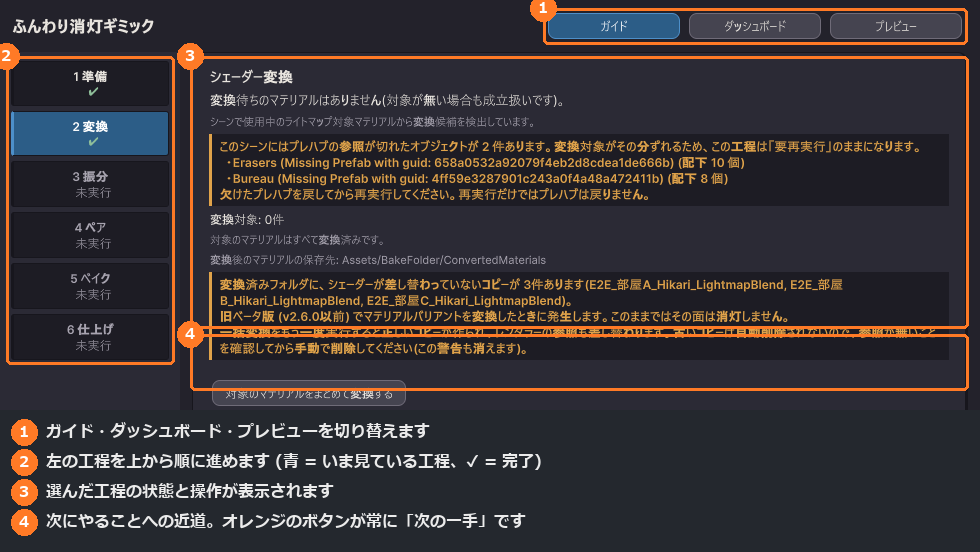

### ステップ1：準備

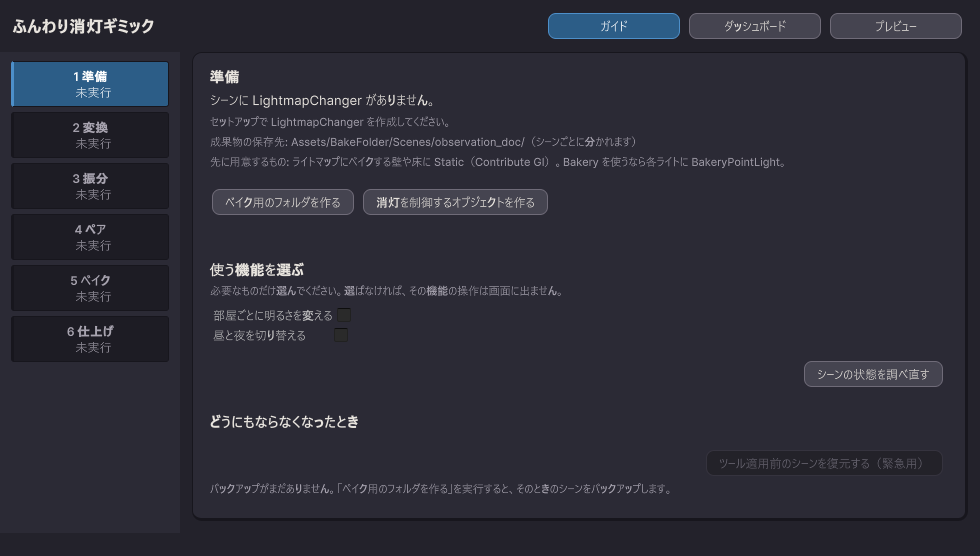

1. 「ベイクフォルダ名」を入力します。初回は `BakeFolder` のままで構いません。入力欄はこのステップだけにあり、ここで決めた名前を変換・ベイク・仕上げが共通で使います。
2. 「ベイク用のフォルダを作る」を押します。
3. 「消灯を制御するオブジェクトを作る」を押します。
4. 状態が更新されない場合は「シーンの状態を調べ直す」を押します。

> シーンを保存すると工程の記録が有効になります。未保存のシーンでは操作できても、進行状態は記録されません。

> 「ベイク用のフォルダを作る」を押したとき、**その時点のシーンをバックアップします**。バックアップは1つだけで、以後は上書きされません。

### ステップ2：シェーダー変換

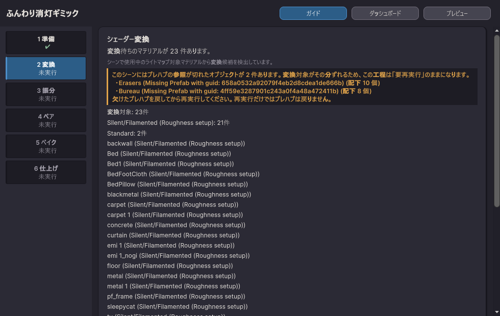

1. 「変換対象」の一覧を確認します。
2. 「変換後のマテリアルの保存先」を確認します。フォルダ名を変えたい場合はステップ1で変更します。
3. 「対象のマテリアルをまとめて変換する」を押します。
4. マテリアルを追加した場合は「シーンの状態を調べ直す」を押してから、もう一度変換します。

独自シェーダー演出を残したいオブジェクトには `Shader Conversion Exclude` を追加します。親に付けると配下のレンダラーが変換対象から外れます。

### ステップ3：振り分け

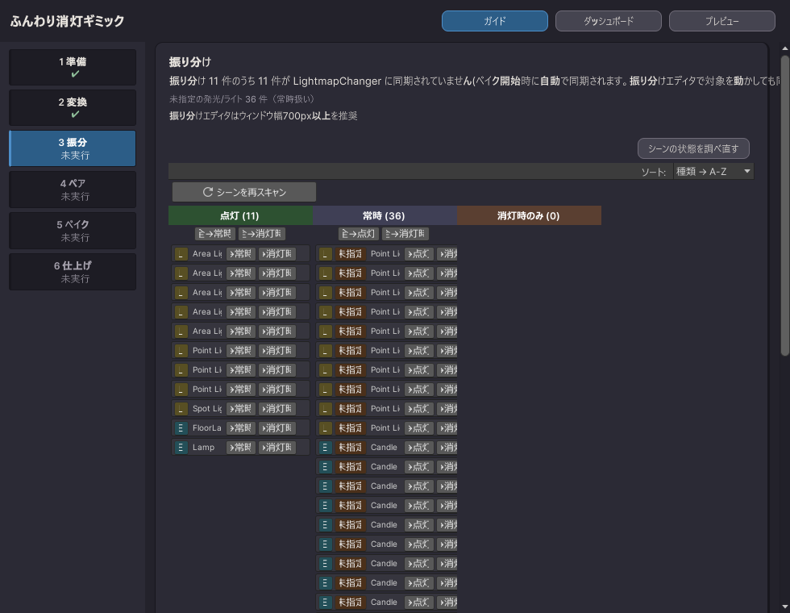

1. 初回は「シーンをスキャン」を押して対象を読み込みます。
2. ライトと発光を「→点灯」「→常時」「→消灯時」で振り分けます。
3. グループ単位で変える場合は「全→点灯」「全→常時」「全→消灯時」を使います。
4. シーンを変更した後は「シーンの状態を調べ直す」を押します。
5. 振り分けが済んだら、一覧の下にある「振り分けを完了にする」を押します。
   このボタンは常に同じ場所にあり、条件が揃うまでは押せない理由が表示されます。

> 一覧に出る全てを振り分ける必要はありません。**振り分けなかったものは「常時」として扱われます**（消灯の影響を受けません）。消灯で暗くしたいものだけ「点灯」へ入れてください。
>
> 自前のアニメーションで Emission を動かすオブジェクトは「常時」へ入れてください。

### ステップ4：ペア生成

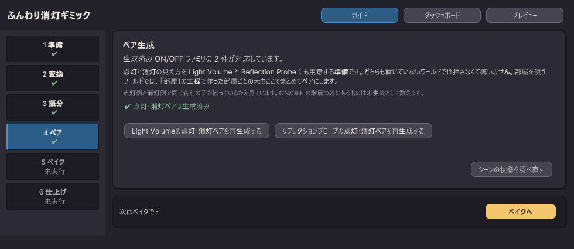

1. 「Light Volumeの点灯・消灯ペアを作る」を押します。
2. 「リフレクションプローブの点灯・消灯ペアを作る」を押します。
3. 状態を確認したい場合は「シーンの状態を調べ直す」を押します。

### ステップ5：ベイク

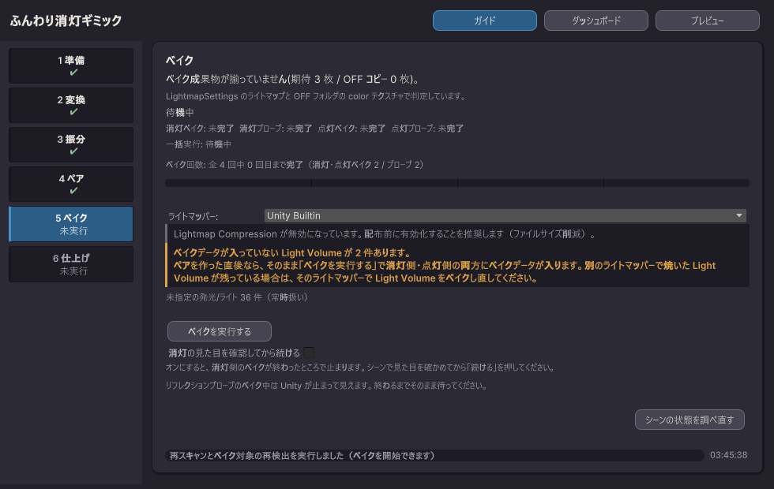

1. 「ライトマッパー:」で「Bakery」「Unity Builtin」「外部ツール（Hikari など・手動）」から選びます。
2. 実行のしかたは2つあり、どちらでも結果は同じです。
   - **一括で実行** — 「ベイクを通しで実行する」を押すと4段階が自動で進みます。
     消灯ルックを途中で確認したい場合は、開始前に「消灯した見た目を途中で確認する」をオンにします。
     一時停止したら「確認できたので続ける」を押します。
   - **1つずつ実行（見た目を確認しながら）** — 各段階を自分のペースで進めます。

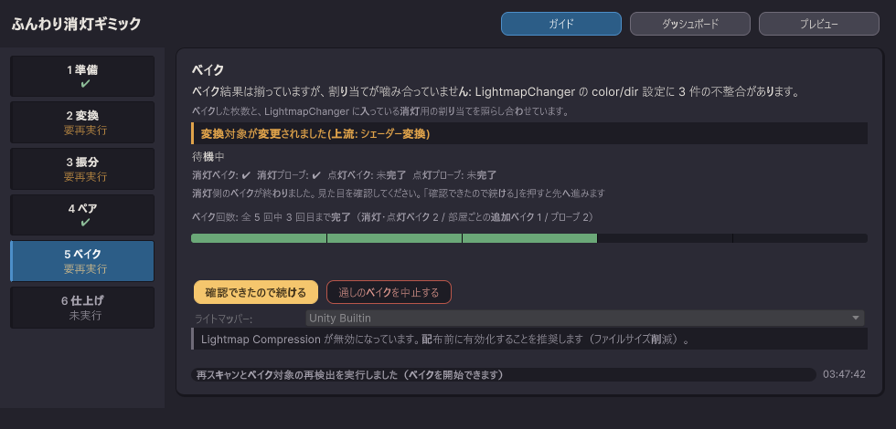

一時停止中のシーンは消灯状態です。シーンビューでそのまま見た目を確認できます。

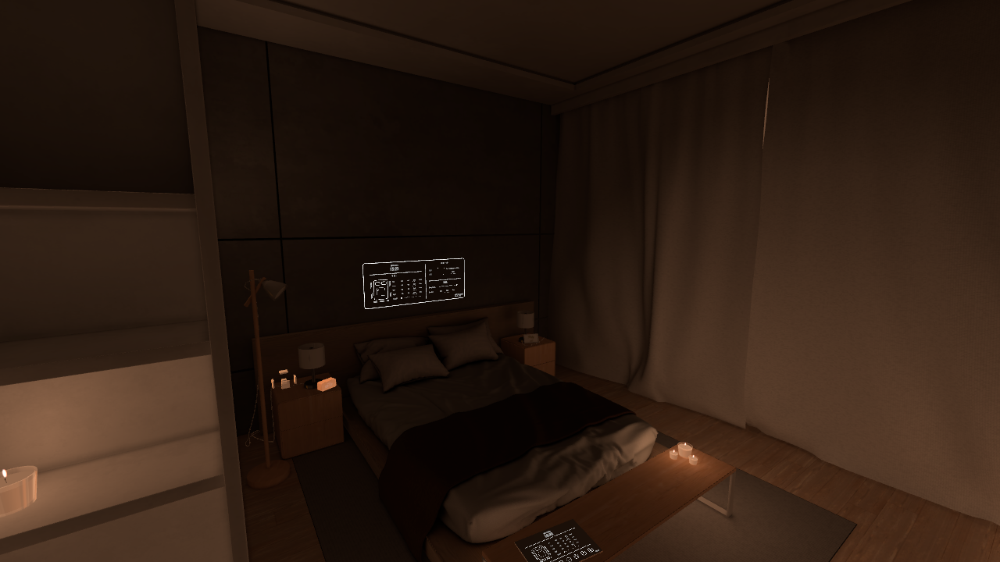

1つずつ実行する場合は、次の順で押します。

1. 「1. 消灯ライトマップをベイクしてコピー」
2. 「2. 消灯用のプローブとLight Volumeをベイク」
3. 「3. 点灯ライトマップをベイクして元に戻す」
4. 「4. 点灯用のプローブとLight Volumeをベイク」

> **外部ツール（Hikari など）を選んだ場合**は、通しの実行は使えません。1つずつ実行してください。ベイクの番になると「外部ツールでベイクを実行してください」と表示されるので、そのツールのウィンドウでベイクし、終わったら「ベイクが終わった」を押します。消灯・点灯の状態づくり、コピー、復元はツールが行います。
>
> ボタンが押せない場合は「シーンの状態を調べ直す」を押してください。ベイク対象（振り分け・Light Volume・LightVolumeSetup）を検出し直します。
>
> 進捗は「消灯ベイク／消灯プローブ／点灯ベイク／点灯プローブ」で表示されます。
>
> 通しのベイクを止める場合は「通しのベイクを中止する」を押します。Bakery 自体のベイク中断は Bakery 側のUIで操作してください。
>
> リロード後、ベイクは自動再開されません。「シーンを点灯状態に戻す」を押してから工程をやり直してください。

> 消灯ライトマップ・Light Volume・リフレクションプローブの割り当ては、**ベイクの中で自動で行われます**。ライトマッパーを切り替えたときも、焼き直すだけで揃います。

### ステップ6：仕上げ

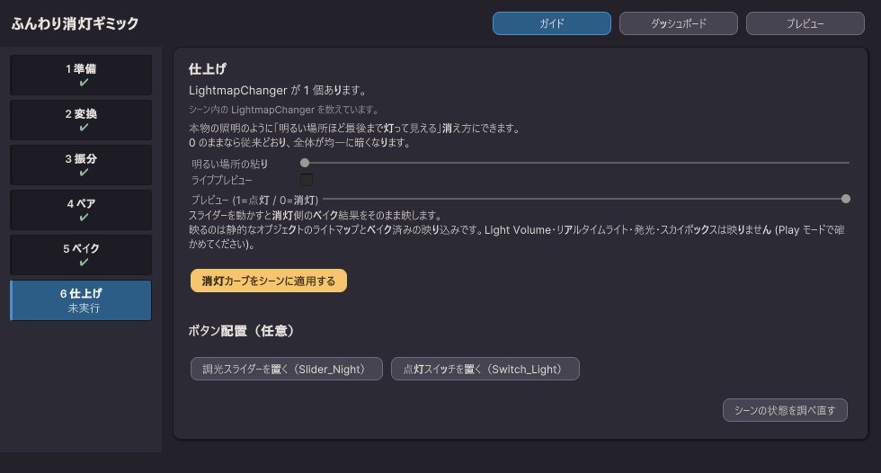

1. 「明るい場所の粘り」を調整します。0なら全体が均一に暗くなります。
2. 「ライブプレビュー」をオンにします。
3. 「プレビュー (1=点灯 / 0=消灯)」を動かします。
4. 「消灯カーブをシーンに適用する」を押します。
5. Play モードで最終確認します。

「ボタン配置（任意）」から、操作用のスイッチ類を置けます（LuraSwitch2 が必要です）。

- 「調光スライダーを置く（Slider_Night）」
- 「点灯スイッチを置く（Switch_Light）」

環境光が消灯に追従しない場合は、「環境光の設定を単色に変える」が表示されるので押します。

セットアップは完了です。以後は「ダッシュボード」で工程の状態を確認できます。

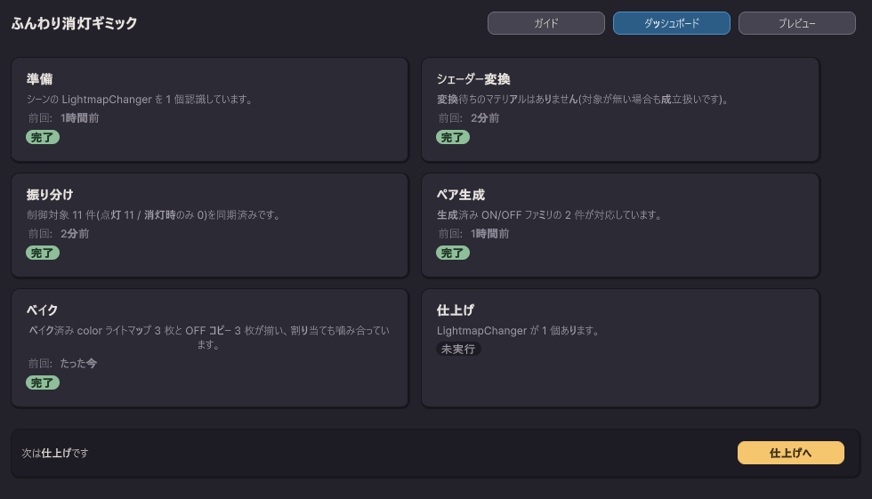

---

## やり直したいとき

| 変更したもの | 戻るステップ |
|-------------|-------------|
| ベイクフォルダや LightmapChanger | ステップ1「準備」 |
| マテリアルやシェーダー | ステップ2「シェーダー変換」 |
| ライトや発光の割り当て | ステップ3「振り分け」 |
| Light Volumes / Reflection Probes の配置 | ステップ4「ペア生成」 |
| オブジェクト配置やベイク設定 | ステップ5「ベイク」 |
| 消灯の粘り・任意の設置物 | ステップ6「仕上げ」 |

変更を検出すると、該当工程と後続工程に再実行の案内が出ます。

### どうにもならなくなったとき

準備タブの下部にある **「ツール適用前のシーンを復元する（緊急用）」** を使います。「ベイク用のフォルダを作る」を押した時点のシーンへ戻します。ボタンの下に、どの時点へ戻るのかが日時で出ます。

次の点にご注意ください。

- **シーンをファイルごと差し替えます。** バックアップを取ったあとにこのシーンへ加えた変更は、このツールと関係のない作業も含めて失われます
- **シーンの外に書き出されたものは戻りません**（焼き上がったライトマップなど）
- 戻すとバックアップは消えます。もう一度取るには「ベイク用のフォルダを作る」を実行し直します

> 消灯ベイクフォルダ（OFF）はプロジェクト単位です。複数シーンで同じベイクフォルダ名を使うと、別シーンのベイク後に「ベイク」「仕上げ」が再実行表示になります。別シーンの成果物へ変わったことを検出した正常な表示です。

---

## 消灯時の見た目を微調整する（任意）

シーンの `LightmapChanger` を選び、Inspector で調整します。

| 設定項目 | 役割 |
|---------|------|
| **ambientIntensityOff** | 消灯時の全体的な明るさ |
| **ambientColorOff** | 消灯時の全体的な色味 |
| **reflectionOffIntensity** | 消灯時の映り込みの強さ |
| **blendDuration** | スイッチで切り替える時間 |

各設定の詳細は [設定リファレンス](settings) をご覧ください。

---

## 完成後のシーン構成のイメージ

```
├── LightmapChanger
├── LightVolume_ON/
├── LightVolume_OFF/
├── ReflectionProbe_ON/
├── ReflectionProbe_OFF/
└── （配置したスイッチやスライダー）
```

---

## 困ったときは

| 症状 | 対処法 |
|------|-------|
| 工程が完了にならない | シーンを保存し、「シーンの状態を調べ直す」を押します |
| リロード後にベイクが止まった | 「シーンを点灯状態に戻す」を押し、案内された工程をやり直します |
| 一括実行が消灯確認で止まった | 「確認できたので続ける」を押します |
| ライトマッパーを切り替えたい | ステップ5で切り替えて、ベイクを実行し直します（他の工程はそのまま使えます） |
| 切り替えると真っ暗になる | ステップ5「ベイク」をやり直します（割り当ても自動で入ります） |
| 別シーンをベイクしたら再実行表示になった | 対象シーンのステップ5と6を再実行します |
| 以前のバージョンでセットアップしたシーンを開いた | 画面上部に取り込みの案内が出ます。「取り込む」を押すと、成立している工程が完了として記録されます |


ライトマッパーを切り替えると、ダッシュボードでは「ベイク」だけが要再実行になります。焼き直せば完了に戻ります。

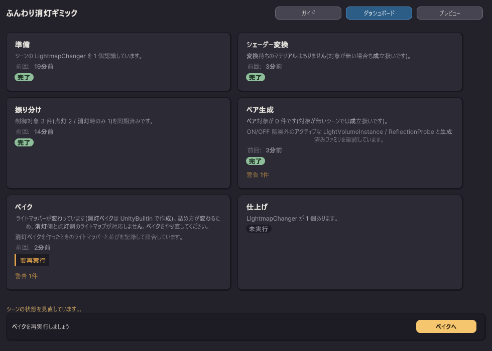
