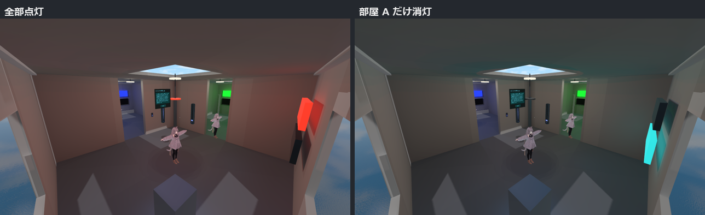
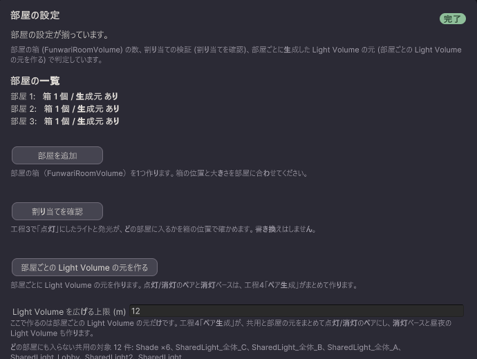

# 部屋ごとに消灯する

ワールドの部屋ごとに、別々に明かりを落とせるようにします。全体の点灯・消灯とは独立に、部屋 A だけ消す、といった操作ができます（8 部屋まで）。

<video src="/funwari-lightblend-docs/video/rooms.mp4" controls></video>

動画: 部屋 A（赤）と部屋 B（緑）を見下ろした構図で部屋 B だけを消灯し、続いて部屋 C の中で消灯 → 点灯に戻します。消した部屋だけが暗くなり、隣の部屋と共用部はそのままです。

## 順番が大事です

部屋の設定は**ベイクの前**に済ませます。あとから部屋を足すと、ベイクをやり直すことになります（ベイクの回数が部屋の数だけ増えます）。

## 手順

1. 工程1「準備」の「使う機能を選ぶ」で「部屋ごとに明るさを変える」をオンにします。工程3 のあとに「部屋」の工程が現れます。
2. 「部屋」の工程で「部屋を追加」を押します。シーンの原点に部屋の箱ができます。**そのままでは働きません。** シーンビューで、箱が部屋を覆うように位置と大きさを合わせます。部屋の数だけ繰り返します。
3. 「割り当てを確認」を押します。工程3 で「点灯」に振り分けたライトと発光が、どの部屋の箱に入るかが表示されます。複数の箱にまたがるものは、**中心位置が入っている部屋**に割り当てられ、警告に割り当て先が出ます。どの箱にも入らないものは**共用**（一覧では部屋番号が「-」）になり、部屋のスライダーには反応せず、全体の点灯・消灯にだけ従います。廊下やロビーの照明はこれで扱います。「常時」「消灯時のみ」に振り分けたものは部屋を持ちません。
4. 「部屋ごとの Light Volume の元を作る」を押します。自分で置いた Light Volume（共用）がシーンにある場合は、先に工程4「ペア生成」を一度押してから戻ってください。有効なままだと「部屋「◯◯」には手置きの Light Volume (名前) があるため生成をスキップしました」で止まります。止まったときは、警告に出ている名前の Light Volume を部屋の箱の外へ移すか、一時的に無効にしてからやり直します。

5. 工程4「ペア生成」と工程5「ベイク」を進めます。ベイクの回数は「消灯 1 回 + 部屋ごとに 1 回 + 点灯 1 回 + プローブ 2 回」になります。

> **消灯ベースの Light Volume が無いと、ベイクは始まりません。** 工程5 で「部屋の設定が揃っていません」と理由が出ます。消灯ベースは工程4「ペア生成」が作るので、工程4 を先に済ませてください。部屋の箱を広げて消灯ベースの外へはみ出した場合も同じように止まります（「消灯ベースの Light Volume が部屋「◯◯」を覆っていません」）。

できた状態: ベイクが終わると、部屋ごとのスライダーが自動で作られます（LuraSwitch2 がある場合。無いときはスライダーは作られず、その旨が警告に出ます。部屋別の調光そのものは働くので、操作は自分の Udon から `FunwariRoomSync` を呼びます）。「プレビュー」で部屋ごとのスライダーを動かして確かめられます。

## 部屋の明かりの届く範囲

部屋ごとの Light Volume の箱は、生成時に「部屋の箱 + 各辺にライトの到達距離」で作られます。「部屋」の工程の「Light Volume を広げる上限」（既定 12 m）は、この到達距離の上限です。Directional のように到達距離の無い光源や極端な range があっても、箱が際限なく大きくならないようにするためのもので、目的はメモリ（ボクセル数は辺の 3 乗で増えます）です。この値はシーンに保存され、共同作業者にも同じ値が伝わります。

役割の分担: どのライトがその部屋のものかは**部屋の箱**で決まり、Light Volume の箱は**その部屋の光をアバターへ届ける範囲**です。Light Volume の中身はその部屋のライトだけをベイクしたものなので、箱を広げても他の部屋の光は混ざりません。

広げるときの注意:

- 広げるのはベイクの前に。ベイクのあとに箱だけ変えると、焼いたボクセルが新しい箱に引き伸ばされてずれます（「要再実行」になるので、焼き直してください）。
- 手で広げた箱は「部屋ごとの Light Volume の元を作る」を押し直すと作り直されて消えます。恒久的に広げたいときは「上限」を上げて作り直してください。
- 複数の部屋の箱が同じ位置・同じ大きさにならないようにしてください。Light Volumes は同一の箱をアトラス上で同じ場所に置くため、部屋ごとのデータが区別できなくなります。

## ベイク後に部屋を変えたいとき

工程5「ベイク」の「部屋別調光」にある「マスクと結線をやり直す」を使います。部屋のスライダーは作り直されるので、スライダーに追加した設定や、他のオブジェクトからスライダーへの参照は消えます。

## 知っておくこと

- 部屋のボタン（トグル）は、自分が押した回数で状態を切り替えます。スライダーや他の人の操作で部屋が変わったあとは、最初の一押しが効かないように見えることがあります（次の版で直します）。
- 非常灯（「消灯時のみ」）を部屋に置くと、その部屋の消灯側に非常灯の分が焼き込まれます。
